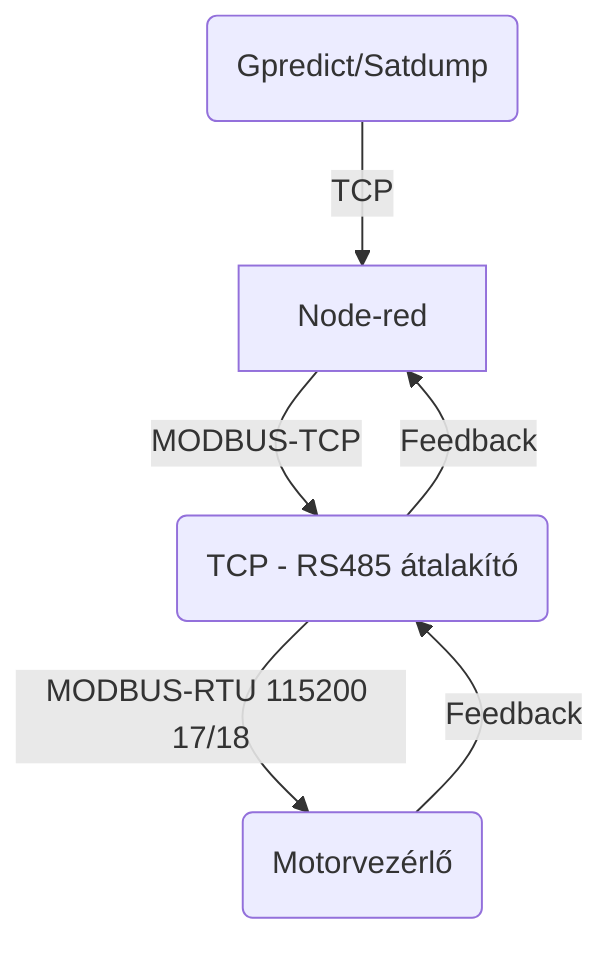
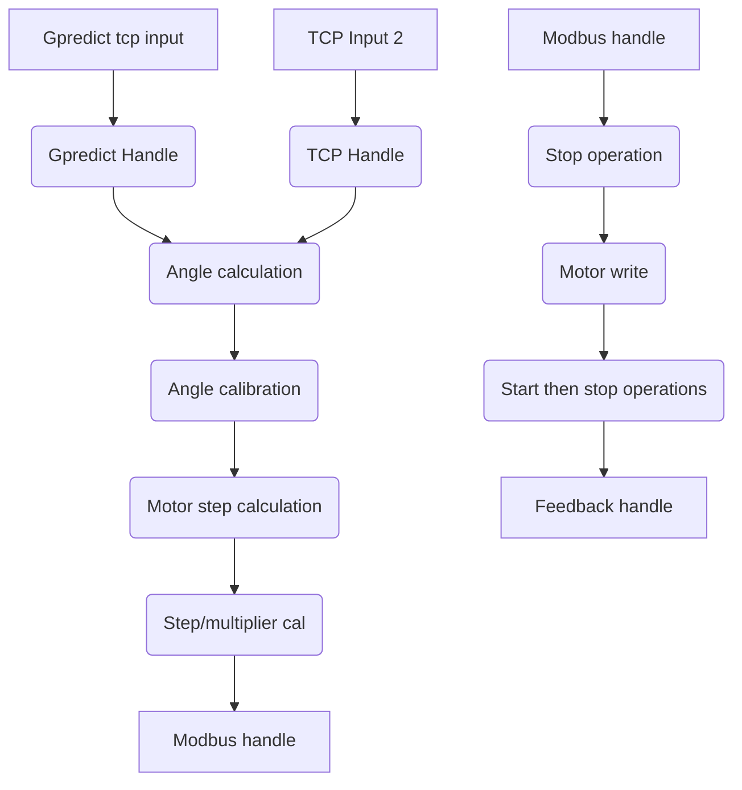

# Hepenix-remote
Rotator control for the hepenix remote on top of Széchenyi University

## Install
Node-red csomagok amik nélkül nem működik:
 - node-red-dashboard 
 - node-red-contrib-modbus

Install:
- flows.json importálása (asszem 2 flow van benne)
- Modbus server választás/config
- Deploy
- Ennyi 

# Operation theory
### Hardver mi honnan hova

### Node-red mi honnan hova

# Használati útmutató
### Figyelmeztetések

 - Ha nem tudod hogy kell használni, inkább kérj segítséget
 - Ha mégse ezt tennéd, két szoftver limit és egy hardver limit van a rendszerben, hogy ne lehessen összetörni
 - Mozgás sebesség kb a negyedén van, lehet emelni rajta ha szükséges, de nem ajánlott

 #### Ha a node-red nem futna, parancssorba:
 >node-red start
#### Gpredict/satdump esetén
 1. Control mode választás (satdump esetében gpredict)
 2. Kalibráció be
 3. TRACK be

#### Manuális mozgatás esetén
1. Control mode: Manuális
2. Kalibráció be
3. TRACK be
4. pozíció beállítás (AZ kívánt / EL kívánt)
5. "Manuális mozgás" gomb

### STOP gomb mindent megállít, TRACK-et kikapcsolja
ALARM RESET ha [0, 132] az alarm kód (rs485 communication error)

## Szervíz

### Fontosabb infók
- Ha valamilyen oknál fogva elmenne hardver végállásba a Y motor (felső), akkor a HARDWARE OVERTRAVEL kikapcsolásával vissza lehet vinni a szenzor felé
- HARDWARE OVERTRAVEL mindig legyen ezután visszakapcsolva 

#### Főoldalon
Home pozíció: Motorvezérlő szerinti 0 pozíció, NEM FIND HOME
Szervíz pozíció: AZ: 172.6, EL: 0 (motorvezérlőben 6-os operation)

#### Szervíz oldalon
FIND HOME - motorvezérlő Home keresési funkciója
### Y TENGELYEN NE HASZNÁLD MERT KI VAN TÖRVE A SZENZOR
X/Y FREE - bekapcsolja a FREE módot a motorban (kézzel el lehetne tekerni), de felesleges a forgatóban lévő hatalmas áttétel miatt
HARDWARE OVERTRAVEL ON - kikapcsolja a szenzor visszajelzést, el lehet hajtani mechanikai ütközésig (kb +-3 fok) 
HARDWARE OVERTRAVEL OFF - normál üzemmód
